## 编码不易，点个star！ ##

**安卓版：https://github.com/cmdbug/TChat**

**本项目使用网易云信IM加上网上开源项目编写，
（附上使用的开源地址，如有侵权或遗漏马上修改）。**

### 使用以下开源项目并修改了部分内容 ###

当前编辑版本与编译环境：

- Xcode 8.3.3 8E3004B
- 模拟器 iOS 10.3
- macOS Sierra 10.12.5

提供已有测试账号，请勿修改相关信息！ 
账号：fuwa 
密码：123456 

截图 

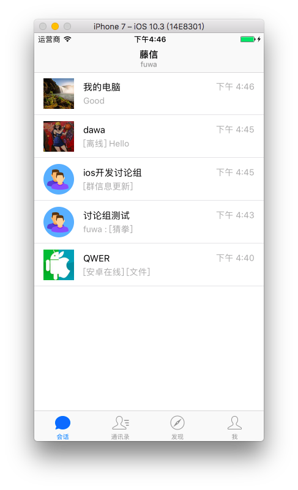
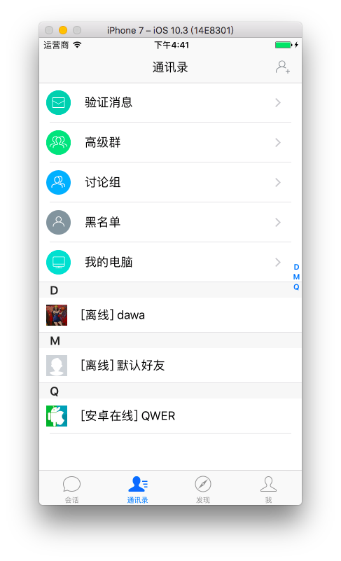
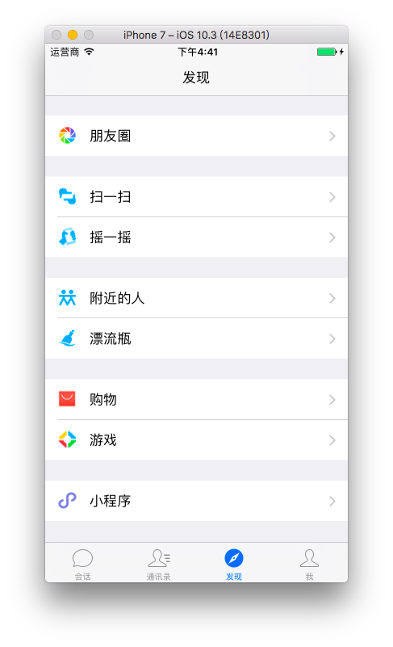

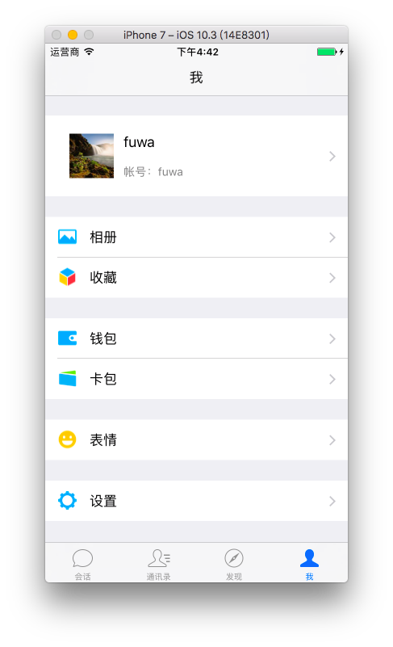
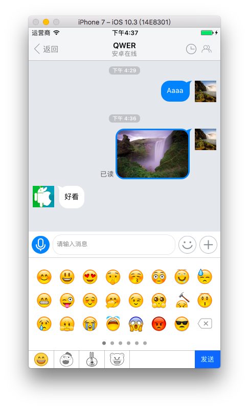
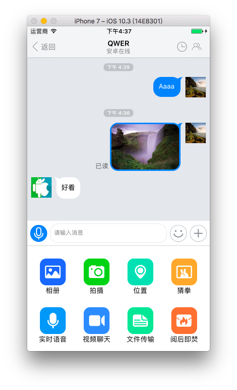

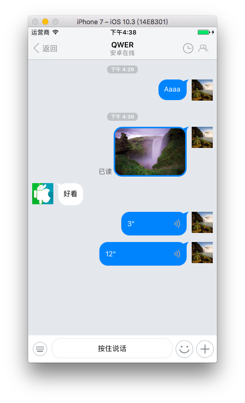

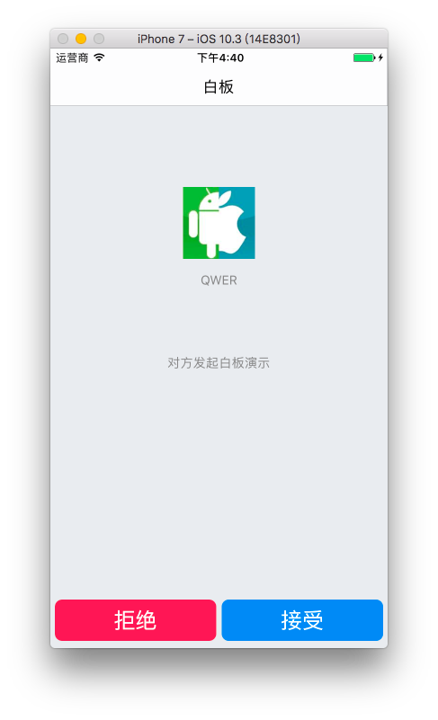

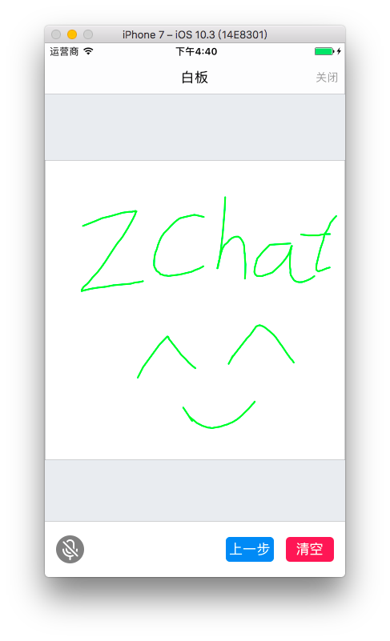

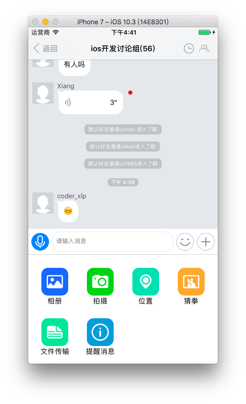

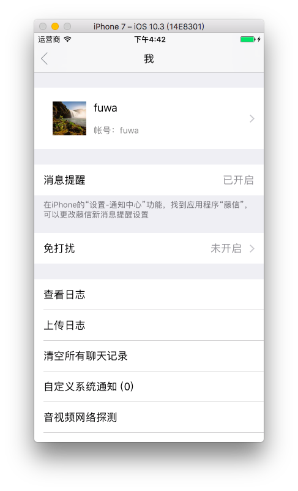
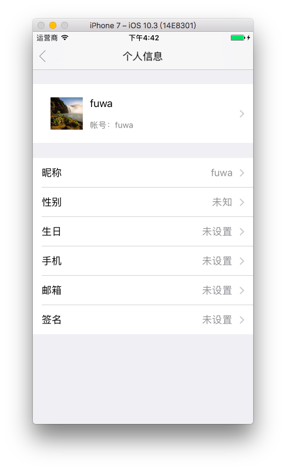
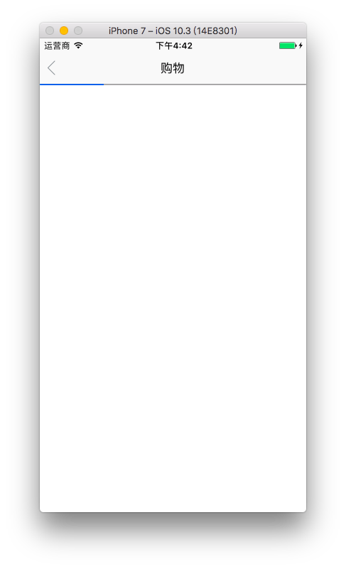

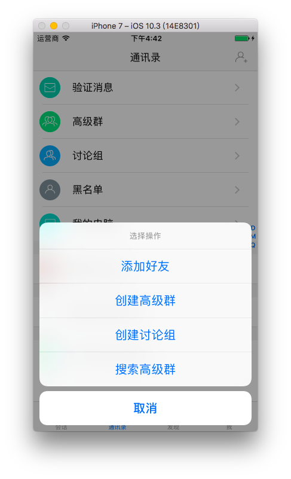

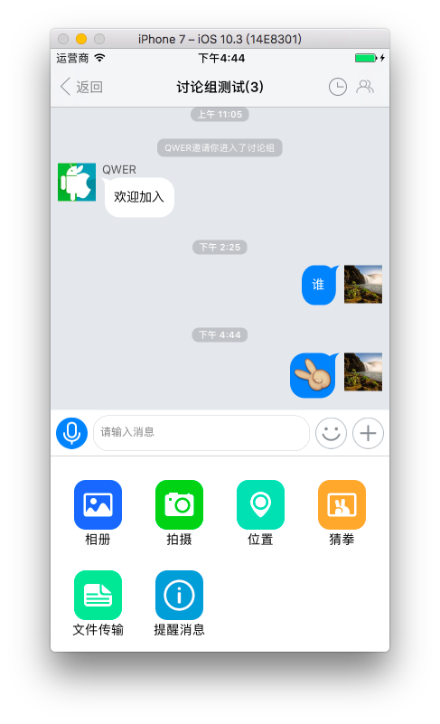

